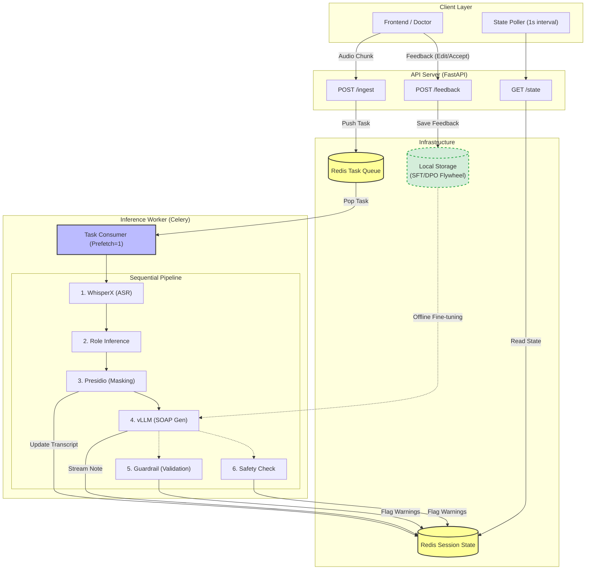

# 🏥 Clinical Scribe Backend (Celery Task Queue Implementation)

> **A Decoupled Backend Architecture using FastAPI and Celery for Single-GPU Environments.**

This project implements an asynchronous backend for clinical scribing. It uses **FastAPI** as an interface and **Celery** with **Redis** to offload inference tasks. The architecture is optimized for resource-constrained environments (e.g., Single T4 GPU): it runs **ASR and Guardrails on the CPU**, reserving the **GPU exclusively for the LLM (vLLM)** to prevent Out-of-Memory (OOM) errors. Additionally, it integrates a **Data Flywheel** mechanism that captures user feedback (Accept/Edit/Reject) to automatically build SFT/DPO datasets for future model improvements.

---

## 🛠 Key Architecture & Features

### 1. **Decoupled Task Queue (Celery + Redis)**

* **Non-Blocking API:** The FastAPI backend acts solely as a producer, pushing audio and generation tasks to a Redis broker. This ensures high concurrency handling without blocking the web server.
* **Serialized Worker:** The Celery worker is configured with `worker_prefetch_multiplier=1`. This enforces strict sequential processing of heavy inference tasks, preventing Out-of-Memory (OOM) errors that typically occur when running vLLM on a single GPU.

### 2. **Isolated Inference Engine**

* **Resource Isolation:** A dedicated Celery worker process manages the GPU lifecycle, loading **vLLM** into VRAM independently of the API service.
* **Async-Sync Bridge:** Implements a custom background event loop within the synchronous worker process to support vLLM's asynchronous generation engine alongside standard synchronous tasks.

### 3. **Data Flywheel & Feedback Loop**

* **Automated Dataset Curation:** The system captures doctor-in-the-loop interactions (`Accept`, `Edit`, `Reject`) directly from the frontend.
* **SFT/DPO Formatting:** User corrections are automatically classified and stored as structured training pairs (Transcript ↔ Adjusted Note). This eliminates manual data labeling, creating a pipeline ready for Supervised Fine-Tuning (SFT) or Direct Preference Optimization (DPO).

### 4. **Clinical Safety & Privacy**

* **Local Guardrails:** Runs **Microsoft Presidio** (PII Masking) and **Biomedical NER/NLI** models locally on the CPU/GPU.
* **Threaded Verification:** Safety checks run in background threads within the worker to verify medical facts in the generated SOAP note against the transcript.

---

## 🛠️ Architecture Overview



-----

## 💻 Tech Stack

  * **Framework:** FastAPI (Python 3.11+)
  * **LLM Serving:** vLLM (AsyncLLMEngine)
  * **ASR:** WhisperX
  * **Database:** Redis (State & Pub/Sub)
  * **Distributed Task Queue:** Celery + Redis (Broker & State Store).
  * **NLP & Safety:** Spacy, HuggingFace Transformers (BERT/DeBERTa), Microsoft Presidio
  * **Infrastructure:** Optimized for NVIDIA T4 (16GB VRAM)

-----

## 🔮 Future Roadmap

I am actively working on evolving this system into a real-time, event-driven microservices architecture.

* **Real-Time Streaming:** Replace the current HTTP polling mechanism with **WebSockets** or **SSE (Server-Sent Events)** to enable sub-second latency for live transcriptions and guardrail alerts.
* **Modern Frontend:** Migrate the UI from Streamlit to a **React** (or Next.js) application to support complex clinical workflows, better state management, and a seamless user experience.
* **Microservices Decomposition:** Break down the current worker architecture into independent microservices (e.g., separated Auth, Guardrails, and Model Serving) for better fault isolation and independent scaling.
-----

## ⚠️ Hardware Requirements

This project is specifically designed and tuned for **Cost-Effective Inference**.

  * **Target GPU:** NVIDIA T4 (16GB VRAM) or equivalent (A10g, L4).
  * **Optimization:**
      * vLLM GPU Utilization is capped at **85%** to reserve memory for WhisperX.
      * Safety models are offloaded to CPU or quantized where possible.
      * **Note:** Running on smaller GPUs requires aggressive quantization (AWQ/GPTQ) or offloading modules.

-----

## 🚀 Getting Started

This project is designed to run in a **Hybrid Environment**: The backend (heavy GPU inference) runs on **Google Colab/Kaggle**, while the frontend (UI) runs on your **Local Machine**.

### 1. **Clone Repository**

Start by cloning the repository to your local machine:

```bash
git clone https://github.com/sirano1004/e2e-clinical-llmops.git
cd e2e-clinical-llmops

```

### 2. **Configuration (.env)**

Create a `.env` file in the root directory by referring to `.env.example`. You will need to upload this file to the remote backend later.

```env
# Example .env
TARGET_MODEL="unsloth/Llama-3-8b-Instruct"
HF_TOKEN="your_huggingface_token"
NGROK_AUTH_TOKEN="your_ngrok_token"
REDIS_URL="redis://localhost:6379"

```

### 3. **Backend Setup (Google Colab / Kaggle)**

The backend requires a GPU (T4/L4). We recommend using the provided notebook.

1. Open `notebooks/colab.ipynb` in Colab or Kaggle.
2. **Upload your `.env` file** specifically to the **`backend/` directory** (not the root).
3. **Step 1:** Run the first cell to install dependencies.
4. **⚠️ IMPORTANT:** After installation, **Restart the Session** (Runtime > Restart Session).
5. **Step 2:** Run the second cell to start the server.
6. Copy the **Public URL** provided by Ngrok (e.g., `https://xxxx-xx-xx-xx.ngrok-free.app`).

### 4. **Frontend Setup (Local Machine)**

Run the Streamlit UI locally to interact with the remote backend. This project manages dependencies using `uv`.

1. **Install Dependencies & Activate Venv:**
```bash
# Ensure uv is installed (pip install uv)
uv sync

# Activate the virtual environment
# MacOS/Linux:
source .venv/bin/activate
# Windows:
# .venv\Scripts\activate

```


2. **Run Streamlit:**
```bash
streamlit run frontend/app.py

```


3. **Connect:**
* Open the Streamlit app in your browser (usually `http://localhost:8501`).
* In the sidebar, paste the **Ngrok URL** you copied from Colab into the **"API base URL"** box and click **Apply**.


### 5. **Run Data Flywheel (Optional)**

To process collected data and generate SFT datasets:

```bash
# Make the script executable
chmod +x ./data_pipeline/run_pipeline.sh

# Run the pipeline
./data_pipeline/run_pipeline.sh

```